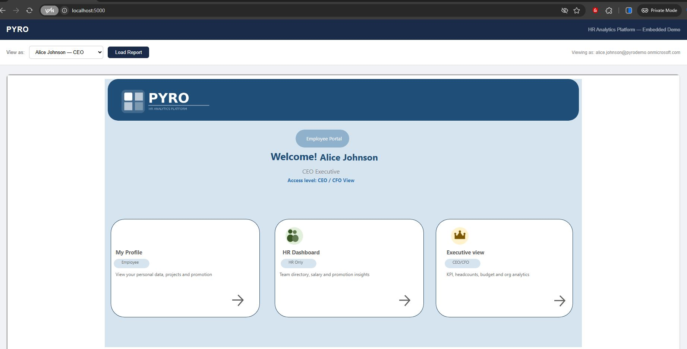
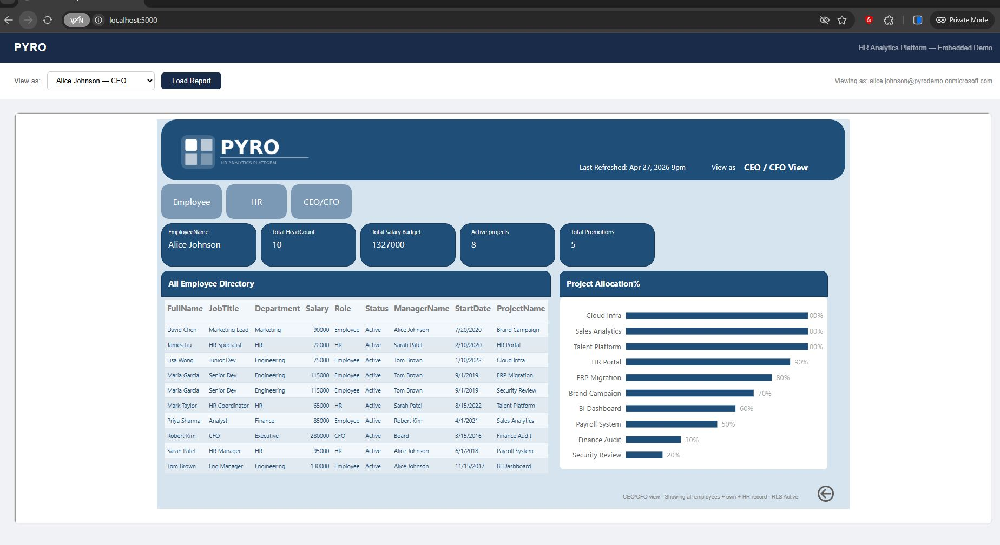
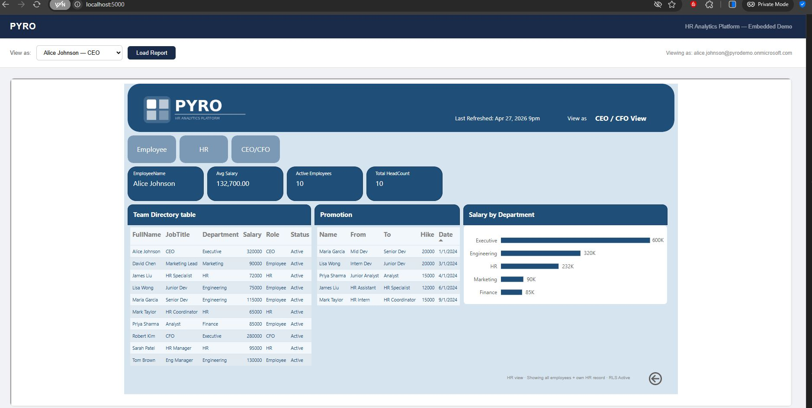
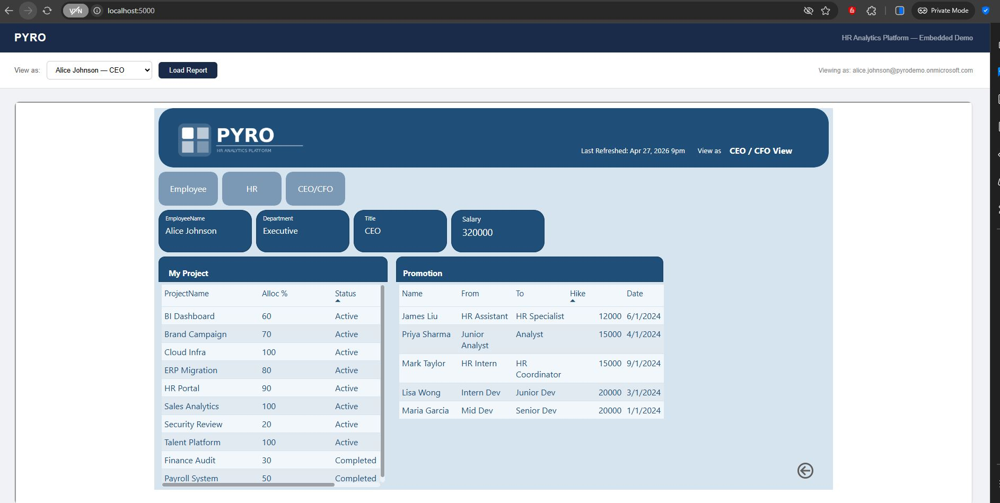
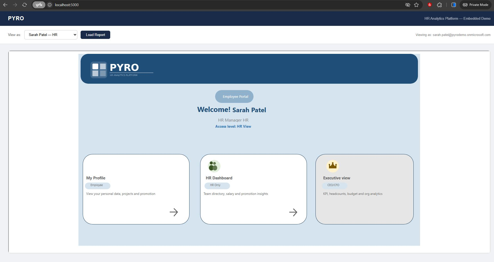
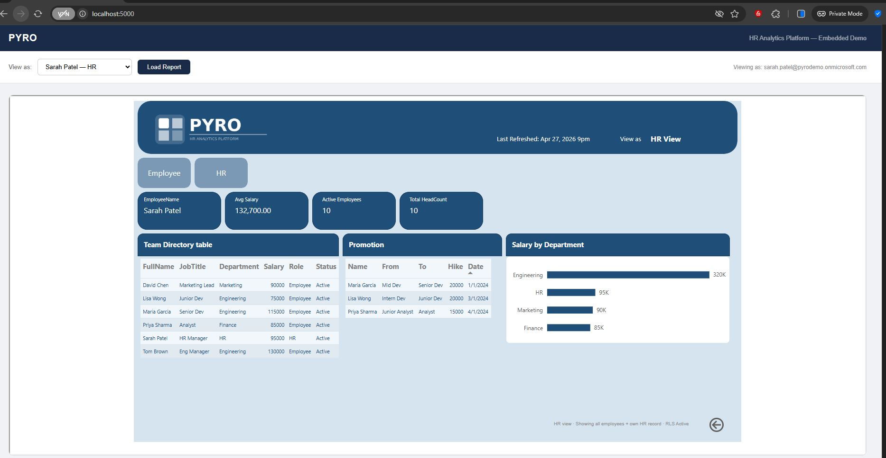
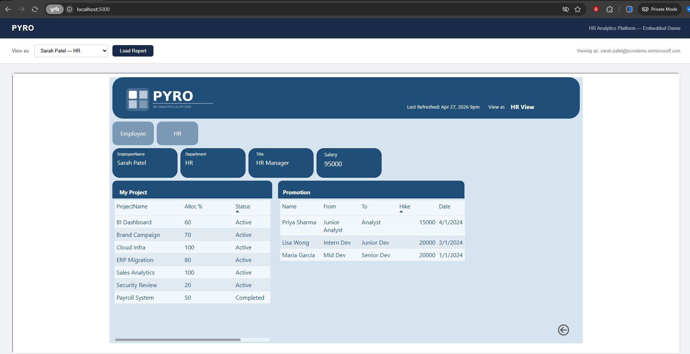
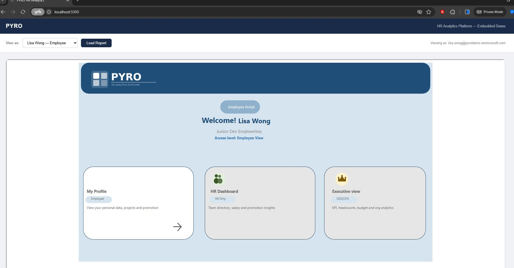
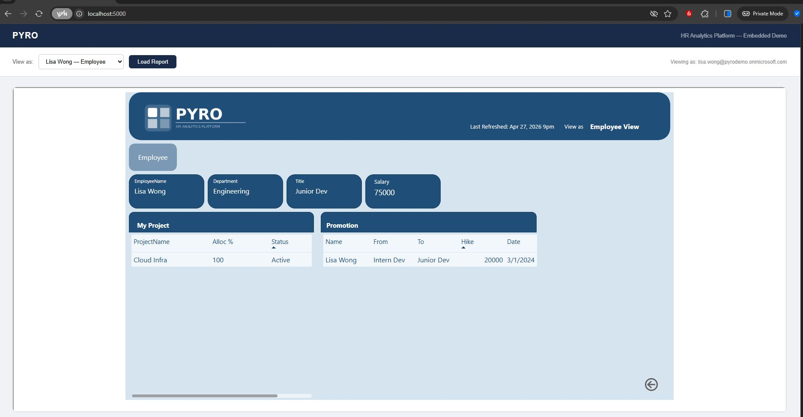

# PYRO HR Analytics — Power BI RLS + Embedded Analytics


A production-aligned Power BI HR Analytics platform implementing **Dynamic Row Level Security (RLS)** and **enterprise embed architecture**. Built end-to-end — from Microsoft Entra ID group provisioning through to a Flask-backed embedded report with role-enforced token generation.

## Screenshots


### CEO / CFO View — Full access, all KPIs






### HR View — Team directory + org-wide metrics + No Access in Executive view




### Employee View — Own profile and projects only




---

## What This Project Demonstrates

| Capability | Implementation |
|---|---|
| Dynamic RLS | `USERPRINCIPALNAME()` with 3 role tiers |
| RLS filter bleeding fix | Disconnected calculated table pattern |
| Enterprise embed | Flask backend + powerbi-client SDK |
| Token-based security | Server-side GenerateToken with RLS identity |
| Role-based navigation | DAX measures controlling page visibility |
| Identity management | Microsoft Entra ID security groups |
| Production documentation | Service principal upgrade path documented |

---

## Project Overview

**PYRO** (HR Analytics Platform) demonstrates how to implement enterprise-grade RLS in Power BI using Microsoft Entra ID security groups, dynamic DAX measures, and a Flask-backed embedded report with audience-based access control.

| Dimension | Detail |
|---|---|
| Tool | Power BI Desktop + Power BI Service (Fabric) |
| Identity | Microsoft Entra ID (pyrodemo tenant) |
| Embed backend | Python Flask + Azure AD OAuth |
| Data Source | Excel (.xlsx) — 4 tables |
| RLS Type | Dynamic RLS using USERPRINCIPALNAME() |
| Roles | 3 roles — CEO/CFO, HR, Employee |
| Pages | 4 pages — Home, Employee, HR, CEO/CFO |

---

## Architecture

### Full System Architecture

```
┌─────────────────────────────────────────────────────────────┐
│                  IDENTITY LAYER — Azure AD                   │
│   PYRO-Embed-App (Service Principal)                        │
│   PBI_Executives │ PBI_HR_Team │ PBI_Employees              │
└────────────────────────┬────────────────────────────────────┘
                         │ OAuth token
┌────────────────────────▼────────────────────────────────────┐
│                  BACKEND LAYER — Flask                       │
│   get_aad_token()  →  get_embed_token(username, role)       │
│   RLS identity embedded in GenerateToken request            │
│   /api/embed-token endpoint                                  │
└────────────────────────┬────────────────────────────────────┘
                         │ embed token
┌────────────────────────▼────────────────────────────────────┐
│              PRESENTATION LAYER — Browser                    │
│   powerbi-client SDK  →  powerbi.embed(config)              │
│   Role switcher UI  →  tokenExpired handler                 │
└────────────────────────┬────────────────────────────────────┘
                         │ filtered data
┌────────────────────────▼────────────────────────────────────┐
│                DATA LAYER — Power BI Model                   │
│   Employees (dim) → Projects (fact)                         │
│   Employees (dim) → Promotions (fact)                       │
│   EmpCount (disconnected — bypasses RLS)                    │
└────────────────────────┬────────────────────────────────────┘
                         │ RLS roles
┌────────────────────────▼────────────────────────────────────┐
│              SECURITY LAYER — Row Level Security             │
│   Role_Executives → [Email]=UPN || 1=1 (full access)       │
│   Role_HR         → Email=UPN OR Role="Employee"            │
│   Role_Employee   → Email=UPN (own row only)                │
└─────────────────────────────────────────────────────────────┘
```

### Embed Token Flow

```
Browser                  Flask Backend              Azure AD / Power BI
   │                          │                           │
   │── click Load Report ────►│                           │
   │                          │── POST /oauth2/token ────►│
   │                          │◄─ AAD access token ───────│
   │                          │                           │
   │                          │── GET /reports/{id} ─────►│
   │                          │◄─ datasetId ──────────────│
   │                          │                           │
   │                          │── POST GenerateToken ────►│
   │                          │   { username, role }      │
   │                          │◄─ embed token ────────────│
   │                          │                           │
   │◄─ { token, embedUrl } ───│                           │
   │                          │                           │
   │── powerbi.embed() ───────────────────────────────────►│
   │◄─ report iframe ─────────────────────────────────────│
```

---

## Repository Structure

```
PYRO-HR-Analytics/
│
├── README.md                          ← This file
├── PRODUCTION.md                      ← Production upgrade guide
├── .gitignore
│
├── embed/                             ← Enterprise embed layer
│   ├── app.py                        ← Flask backend (token service)
│   ├── index.html                    ← Frontend (powerbi-client SDK)
│   ├── requirements.txt              ← Python dependencies
│   ├── .env.example                  ← Environment template
│   ├── .gitignore                    ← Prevents .env from being committed
│   └── PRODUCTION.md                 ← Service principal upgrade path
│
├── data/
│   ├── PYRO_Clean.xlsx               ← Main data source (4 sheets)
│   └── PYRO_RLS_SampleData_RealWorld.xlsx
│
├── report/
│   └── PYRO_RLS.pbix                 ← Power BI Desktop report file
│
├── assets/
│   ├── PYRO_Logo_Color.png
│   ├── PYRO_Logo_Transparent.png
│   ├── PYRO_Logo_White.png
│   ├── PYRO_Logo.svg
│   ├── icon_employee.png
│   ├── icon_hr.png
│   ├── icon_executive.png
│   └── icon_lock.png
│
├── theme/
│   └── PYRO_Theme.json               ← Power BI custom theme
│
├── docs/
│   ├── RLS_Issue_Solution.docx       ← RLS filter bleeding issue & fix
│   └── PYRO_RLS_Implementation_Guide.docx
│
└── dax/
    ├── rls_roles.dax                 ← All 3 RLS role expressions
    ├── measures_kpi.dax              ← KPI card measures
    ├── measures_employee.dax         ← Employee tab measures
    ├── measures_navigation.dax       ← Role detection + nav measures
    └── empcout_table.dax             ← Disconnected table definition
```

---

## Embed Layer

### How it works

The `/embed` folder contains a production-aligned Power BI embedding implementation. A Flask backend generates embed tokens server-side with RLS identity — the browser never controls which role is assigned.

```python
# Backend decides the role — never the frontend
role_map = {
    "executive": "Role_Executives",
    "hr":        "Role_HR",
    "employee":  "Role_Employee"
}

# RLS identity embedded in the token request
{
    "accessLevel": "View",
    "identities": [{
        "username": username,    # who is viewing
        "roles":    [rls_role],  # which RLS role
        "datasets": [dataset_id] # which dataset
    }]
}
```

### Run locally

```bash
cd embed
pip install -r requirements.txt
cp .env.example .env        # fill in your Azure AD + Power BI values
python app.py
# open http://localhost:5000
```

### Current vs production auth pattern

| | Current (Master User) | Production (Service Principal) |
|---|---|---|
| Auth flow | ROPC — username + password | Client credentials — no password |
| MFA | Must be disabled | Always enabled |
| Secret storage | `.env` file | Azure Key Vault |
| Licence needed | Power BI Standard | Power BI PPU or AAD Premium P1 |
| Code change | `grant_type: password` | `grant_type: client_credentials` |

See [`embed/PRODUCTION.md`](embed/PRODUCTION.md) for the complete upgrade path.

---

## Data Model

### Tables

| Table | Type | Rows | Purpose |
|---|---|---|---|
| `Employees` | Dimension | 10 | Core employee data — RLS applied here |
| `Projects` | Fact | 10 | Project allocations linked by EmployeeID |
| `Promotions` | Fact | 5 | Promotion records linked by EmployeeID |
| `RLS_SecurityMapping` | Security | 5 | Email → PBI_Role mapping |
| `EmpCount` | Disconnected | 10 | Bypasses RLS for org-wide KPIs |
| `_Measures` | Measure table | — | All DAX measures centralised |

### Relationships

```
Projects     ──(Many)──► Employees ◄──(Many)── Promotions
                              │
                        (One-to-One)
                              │
                    RLS_SecurityMapping
```

---

## RLS Implementation

### Roles

```dax
-- Role_Executives (filter on Employees table)
[Email] = USERPRINCIPALNAME() || 1 = 1

-- Role_HR (filter on Employees table)
[Email] = USERPRINCIPALNAME()
    || [Role] = "Employee"

-- Role_Employee (filter on Employees table)
[Email] = USERPRINCIPALNAME()
```

### Security Group Mapping

| Entra ID Group | Power BI Role | Access |
|---|---|---|
| PBI_Executives | Role_Executives | All rows, all pages |
| PBI_HR_Team | Role_HR | Own row + all Employee rows |
| PBI_Employees | Role_Employee | Own row only |

---

## Key Technical Challenge — RLS Filter Bleeding

### Problem

When `Role_HR` is applied, the RLS filter reduces `Employees` to 6 rows. All DAX measures then calculate on 6 rows — causing KPI cards to show wrong org-wide totals.

```dax
-- WRONG — returns 6 for HR role, not 10
Total Headcount = COUNTROWS(Employees)

-- ALL() and REMOVEFILTERS() do NOT fix this
-- RLS is applied at VertiPaq engine level BEFORE DAX evaluation
```

### Solution — Disconnected Calculated Table

```dax
EmpCount =
SUMMARIZE(
    ALL(Employees),
    Employees[EmployeeID],
    Employees[FullName],
    Employees[Status],
    Employees[Salary],
    Employees[Department],
    Employees[Role],
    Employees[JobTitle]
)
```

`SUMMARIZE(ALL(Employees))` captures a full snapshot at model load time — before RLS applies. Since `EmpCount` has no relationships, RLS never propagates to it.

```dax
-- CORRECT — always returns org-wide totals regardless of role
Total Headcount    = COUNTROWS(EmpCount)
Active Employees   = CALCULATE(COUNTROWS(EmpCount), EmpCount[Status] = "Active")
Avg Salary         = AVERAGE(EmpCount[Salary])
Total Salary Budget = SUM(EmpCount[Salary])
```

---

## Report Pages

### Home (Landing Page)
- Dynamic welcome message using `My Name` measure
- Role-aware navigation cards — HR and Executive cards hidden for Employee role
- Blocking rectangle pattern to prevent unauthorized navigation

### Employee Tab
- Profile cards: Name, Department, Job Title, Salary, Status, Manager
- My Projects table (own projects only via USERPRINCIPALNAME())
- My Promotions table (own promotions only)

### HR Tab
- KPI cards using EmpCount (org-wide, bypasses RLS)
- Team Directory table (Employee rows + own HR row)
- Salary by Department bar chart

### CEO/CFO Tab
- 4 KPI cards: Headcount, Salary Budget, Active Projects, Total Promotions
- 3 bar charts: Headcount by Dept, Salary by Dept, Project Allocation %
- Full Employee Directory

---

## Test Users

| User | Role | Expected behaviour |
|---|---|---|
| alice.johnson@pyrodemo... | CEO | All data, all pages, full KPIs |
| robert.kim@pyrodemo... | CFO | All data, all pages, full KPIs |
| sarah.patel@pyrodemo... | HR | Own row + all employee rows |
| maria.garcia@pyrodemo... | Employee | Own row only |
| lisa.wong@pyrodemo... | Employee | Own row only |

---

## Setup Instructions

### Prerequisites
- Power BI Desktop (April 2026 or later)
- Microsoft 365 Business Standard or Power BI Pro licence
- Microsoft Entra ID tenant with Global Administrator access
- Python 3.11+ (for embed layer)

### Power BI report
```bash
git clone https://github.com/arpitaonnet/PYRO-HR-Analytics.git
```
1. Open `report/PYRO_RLS.pbix` in Power BI Desktop
2. Update data source to point to your local `PYRO_Clean.xlsx`
3. Update email domain in `data/PYRO_Clean.xlsx` to match your tenant
4. Apply theme from `theme/PYRO_Theme.json`
5. Publish to your Power BI workspace

### Embed layer
```bash
cd embed
pip install -r requirements.txt
cp .env.example .env
# fill in AZURE_TENANT_ID, AZURE_CLIENT_ID, AZURE_CLIENT_SECRET,
# PBI_WORKSPACE_ID, PBI_REPORT_ID, PBI_USERNAME, PBI_PASSWORD
python app.py
```
Open `http://localhost:5000`, select a user, click Load Report.

---

## Skills Demonstrated

- End-to-end Power BI development (requirements → embedded app)
- Dynamic Row Level Security with `USERPRINCIPALNAME()`
- Microsoft Entra ID group-based access control
- Enterprise embed architecture — Flask backend + powerbi-client SDK
- Server-side embed token generation with RLS identity assertion
- OAuth 2.0 token flows — ROPC and client credentials
- Azure AD app registration and API permissions
- Star schema data modelling
- Advanced DAX — SUMMARIZE, CALCULATE, USERPRINCIPALNAME, SELECTEDVALUE
- RLS filter bleeding problem — disconnected table solution
- Power BI App with audience-based access control
- Production upgrade path documentation

---

## Certifications

| Certification | Relevance |
|---|---|
| PL-300 — Power BI Data Analyst | Core Power BI skills |
| DP-600 — Microsoft Fabric Analytics Engineer | Fabric + advanced analytics |

---

## Licence

This project is for portfolio and educational purposes.

---

## Author

**Arpita Ghosh**
[LinkedIn](https://linkedin.com/in/arpitaonnet) · [GitHub](https://github.com/arpitaonnet)
